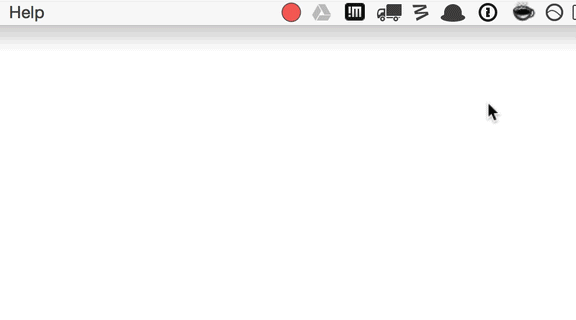

# TDD Reminder

<!--  -->


> OS X status bar application to help you stick to the test-driven development cycle *red-green-refactor*

Built with <3 and [NW.js](http://nwjs.io/).

### [Download](https://github.com/simon-johansson/TDD-Reminder/releases/tag/v0.0.1)

## About
**TDD Reminder** shows up as a coloured dot in your status bar, reminding you of what phase in the *red-green-refactor* cycle you are currently in.


Unsure of what you should be doing? Just have a peak at the status bar.

Dot                       | What you should be doing
------------------------- | ---------------------------------------------
    | Write a faling unit test
  | Write production code that makes your test pass
   | Clean up the mess you just made

## Workflow
1. Preform the activities of the current phase (i.e write a test that fails, make that test pass or clean up your code). When you are done…
2. Click on the dot, this will open the **TDD Reminder** window.
3. Click somewhere inside the coloured box, this will move you to the next phase and change the color of the dot. Repeat step one.



## Why?
Sticking to the [laws of TDD](http://blog.cleancoder.com/uncle-bob/2014/12/17/TheCyclesOfTDD.html) isn’t always trivial for a number of different reasons. With lacking motivation and discipline it´s easy to start skipping or prolonging phases, maybe in the hopes of progressing faster. Without a reminder from time to time one might take the laws for granted and become too lenient, blurring the lines between the different phases.

**TDD Reminder** might help you in one of the following ways:

* Visualising the transitions between the phases makes the bouderies between them sharp and clear.
* It becomes really hard to stray off the beaten track when you are constantly reminded of what you should be doing.
* By clicking on the dot and taking the decision to move to the next phase, you are making a mini promise to yourself that you (hopefully) will be reluctant to break.

## Installing
1. Latest version (v0.0.1) are available for **[download here](https://github.com/simon-johansson/TDD-Reminder/releases/tag/v0.0.1)**.
2. Download the ``osx32`` or ``osx64`` version depending on your system.
3. Unzip and place the .app file it in your Applications folder.

When attempting to start **TDD Reminder** for the first time a warning saying *“TDD Reminder can’t be opened because it is from an unidentified developer"* will appear. To override this you will need to go to *System Preferences...* > *Security and Privacy* and then click "Open Anyway". After that you should be good to go!

## REST interface
**TDD Reminder** spins up a server in the background on ``http://localhost:22789`` which accepts POST requests. By sending a JSON object with the key of ``state`` and the value of either ``red``, ``green`` or ``refactor`` you are able to change the current phase.

**Using curl**
```bash
# This would change the app state to "refactor", making the dot blue
$ curl -H "Content-Type: application/json" -X POST -d '{"state":"refactor"}' http://localhost:22789/
```

**Using node.js with the [request](https://github.com/request/request) module**
```javascript
// This would change the app state to "green"
var request = require('request');
request.post('http://localhost:22789', {form: { state:'green' }});
```

You could for example set up your test runner to change the phase to "green" if you have a failing test (which would mean that you should write production code to make that test pass). Or change the phase to "refactor" if all your tests are passing.

#### Changing the server port
Specify a custom port by setting the environment variable ``TDD_REMINDER_PORT``. Putting the following line in your `.bashrc`, `.zshrc` or equivalent shell config file will start the server on port 3456:

```bash
export TDD_REMINDER_PORT="3456"
```

## License

MIT

